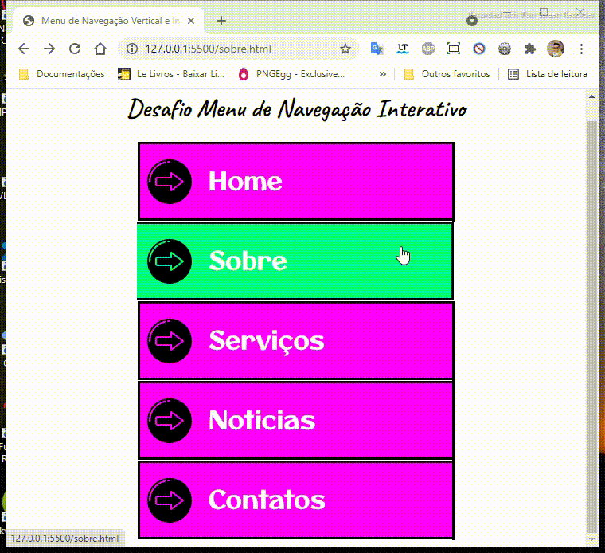

<h1>Barra de Navegação Vertical e Interativa</h1>

 

 &nbsp;
    

## Sobre este projeto
 

> Um desafio pessoal de criar sozinho uma barra de navegação vertical e interativa com recursos que tenho familiaridade. <a href="">🔗Clique aqui!</a>

## Status ✌️

 **Concluído 🚀💻

## Recursos & Ferramentas 

* Git 
* Github 
* Visual Studio Code 
* Paint (aplicação do Windown 
* CSS 
* Html
* Icones online - [Flaticon](https://www.flaticon.com/br/)
* Fonts Google

## O quê aprendi? 🙋‍♂️

* Criar uma arte para menu de navegação do menu 

* Compreesão de posicionamento 

* Compreesão de classes 

* Lógica e sequência de interatividade durante navegação 

## 🐧🖖 Créditos & 🔗 Referências 
 

- Desenvolvimento Web Completo 2021 + 20 projetos -[Udemy](https://www.udemy.com/share/101WqG2@Pm1KfUtjSVcKdEFLAHJOVBRuSlc=/)

## Autor do projeto 👊

### Leonardo Araújo  
**Universitário 🧑‍🎓 de Sistemas de Informação 💻**

***"Os desafios não são ruins se... VOCÊ decidir CRESCER com eles 🌠✨🚶‍♂️"*** 

